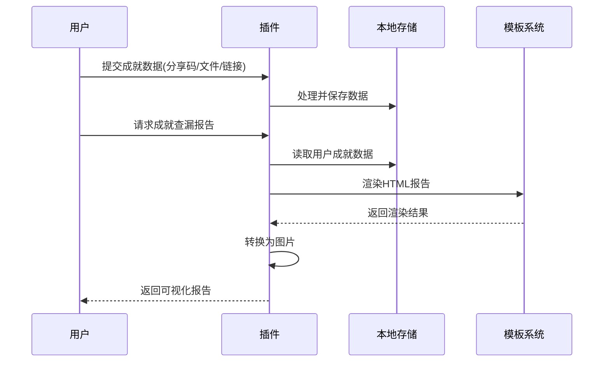

# 🎯 mCat-ac 成就查漏插件

<div align="center">
  
  
  <div style="margin-top: 10px;">
    
    
    
    
  </div>
</div>

## 📋 目录

- [🎯 mCat-ac 成就查漏插件](#-mcat-ac-成就查漏插件)
  - [📋 目录](#-目录)
  - [✨ 插件简介](#-插件简介)
  - [🚀 功能特性](#-功能特性)
  - [📦 安装方法](#-安装方法)
  - [📖 使用说明](#-使用说明)
    - [用户指令](#用户指令)
    - [管理员指令](#管理员指令)
  - [⚙️ 插件配置](#️-插件配置)
  - [🔄 数据流](#-数据流)
  - [⚠️ 注意事项](#️-注意事项)
  - [📝 更新日志](#-更新日志)
  - [🤝 贡献指南](#-贡献指南)
  - [📜 许可证](#-许可证)
  - [📬 反馈与支持](#-反馈与支持)

## ✨ 插件简介

**mCat-ac** 是YunzaiBot的一个专业成就查漏工具插件，专为原神玩家设计，帮助您轻松检查尚未完成的成就，并生成可视化报告。通过直观的界面和丰富的自定义选项，让您的成就收集之旅更加高效

## 🚀 功能特性

### 核心功能
- **🔄 多种录入方式**：支持分享码、文件导入、椰羊网站链接等多种成就数据录入方式
- **📊 智能查漏**：精确分析未完成成就，支持分类显示，快速定位遗漏内容
- **🎨 个性化主题**：丰富的可配置主题样式，支持自定义背景和显示效果
- **🔧 管理员工具**：提供校对文件更新和背景图片管理等专业功能

### 技术特点
- **⚡ 高性能渲染**：优化的HTML渲染和图片转换流程
- **🔒 本地存储**：所有数据保存在本地，保护用户隐私
- **📱 多端兼容**：适配各种聊天环境的显示需求
- **🛠️ 模块化设计**：清晰的代码结构，便于维护和扩展

## 📦 安装方法

### 前置条件
- 已安装 **YunzaiBot**
- Node.js 版本 **v16** 或更高

### 安装步骤
1. 将本插件放入YunzaiBot的plugins目录下
#### Gitee源
```bash
git clone https://gitee.com/mcat0/acm.git ./plugins/mCat-ac/
```
#### GitHub源
```bash
git clone https://github.com/mCat-0/mCat-ac.git ./plugins/mCat-ac/
```
#### GitLab源
```bash
git clone https://gitlab.com/mcat0/mCat-ac.git ./plugins/mCat-ac/
```


2. 进入插件目录，运行以下命令安装依赖：
### 使用 npm
   ```bash
   npm install
   ```
   或
### 使用 pnpm
   ```bash
   pnpm install
   ```
3. 重启YunzaiBot以加载插件
4. 使用 `#更新校对文件` 命令获取最新的成就数据库

## 📖 使用说明
### 用户指令

| 命令 | 功能描述 | 使用示例 |
|------|---------|----------|
| **#成就帮助** | 显示详细帮助信息 | `#成就帮助` |
| **#成就录入** | 启动成就录入向导 | `#成就录入` |
| **#成就录入[ID/名称]** | 直接录入特定成就 | `#成就录入 123` |
| **#成就查漏** | 生成成就查漏报告 | `#成就查漏` |
| **#成就重置** | 清空当前用户数据 | `#成就重置` |
| **分享椰羊网站链接** | 导入成就数据 | (私聊发送链接) |

### 管理员指令

| 命令 | 功能描述 | 权限要求 |
|------|---------|----------|
| **#更新校对文件** | 自动更新成就数据 | 管理员 |
| **#强制更新校对文件** | 强制重新下载数据 | 管理员 |
| **#成就调试** | 显示调试信息 | 管理员 |
| **#ACM开启api** | 启用网络背景图片 | 管理员 |
| **#ACM关闭api** | 禁用网络背景图片 | 管理员 |
| **#ACM开启随机** | 启用随机背景 | 管理员 |
| **#ACM关闭随机** | 禁用随机背景 | 管理员 |

## ⚙️ 插件配置

插件配置文件位于 `res/wFile/def/theme-config.yaml`，您可以自定义以下内容：

### 主题配置
- **页面标题**：自定义报告页面的标题
- **背景设置**：配置背景颜色、图片和透明度
- **布局选项**：调整内容排布和间距

### 成就卡片样式
- **卡片尺寸**：设置成就卡片的大小
- **颜色方案**：自定义卡片主题色和高亮效果
- **边框样式**：调整边框粗细和圆角
- **文字排版**：设置字体、大小和颜色

## 🔄 数据流



## ⚠️ 注意事项

- **🔒 隐私保护**：成就数据包含个人游戏进度，建议在私聊环境下使用
- **💾 数据安全**：所有成就数据仅保存在本地，不会上传至任何服务器
- **🔄 定期更新**：请定期使用 `#更新校对文件` 命令确保成就数据的准确性
- **⚙️ 依赖管理**：首次使用必须安装axios依赖，否则无法正常运行核心功能
- **📱 显示优化**：在不同设备上可能需要调整主题配置以获得最佳显示效果

## 📝 更新日志

### v2.7.9 (最新版本)
- 🏗️ 重构代码结构，提高模块化程度和可维护性
- 🧹 移除冗余代码，优化模块间依赖关系
- 📝 统一使用ES模块语法，提升代码质量
- 🐛 修复特殊环境下的兼容性问题，增强稳定性

### v2.7.0
- 📁 新增椰羊成就文件格式支持
- 🎨 添加主题自定义功能，支持个性化展示
- ⚡ 优化图片生成性能，减少等待时间

### v2.0.0
- 🔄 重构核心代码架构，提升可扩展性
- 📊 新增多模板支持，提供多样化的展示方式
- 🛡️ 完善错误处理机制，提高系统稳定性

## 🤝 贡献指南

欢迎对项目进行贡献！如果您有任何改进建议或发现问题，请：

1. Fork 本仓库
2. 创建您的特性分支 (`git checkout -b feature/amazing-feature`)
3. 提交您的更改 (`git commit -m 'Add some amazing feature'`)
4. 推送到分支 (`git push origin feature/amazing-feature`)
5. 打开一个 Pull Request

## 📜 许可证

本项目采用 **MIT 许可证** 开源 - 详情请查看 [LICENSE](LICENSE) 文件

## 📬 反馈与支持

- **问题反馈**：在项目仓库提交 issue
- **功能建议**：欢迎提供新功能想法
- **使用帮助**：查看完整的命令列表和使用示例

我们致力于持续改进插件体验，感谢您的支持与使用！